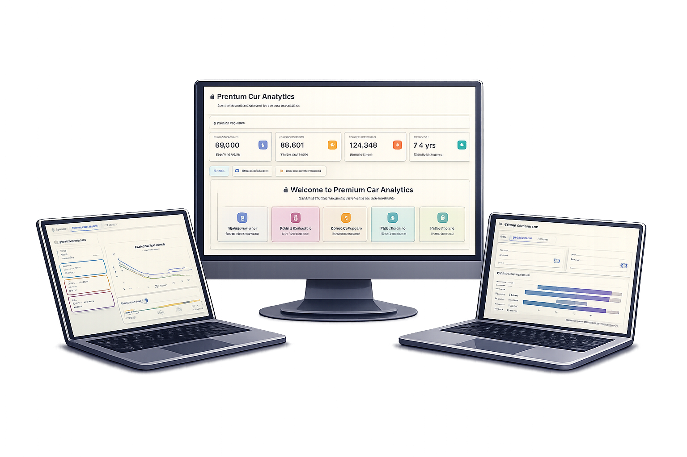

# 🚗 Premium Car Analytics Dashboard

<div align="center">


[](https://visproject.onrender.com)

**Advanced Vehicle Intelligence & Market Insights Platform**

*Real-time Market Intelligence | Data-Driven Decisions | Executive Analytics*
---

</div>


<div align="center">
  
</div>

---


## 🔗 Live Dashboard (Render)

<div align="center">

### 🚀 **Live Interactive Dashboard**

### 👉 **[https://visproject.onrender.com](https://visproject.onrender.com)** 👈

*Public demo • Hosted on Render • Real-time analytics*
Hosted on Render • Public demo • Available 24/7

</div>

## 📊 Overview

Premium Car Analytics is a comprehensive dashboard application that provides deep insights into the Israeli car market. Built with **Dash** and **Plotly**, it offers interactive visualizations, smart filtering, and executive-grade analytics for vehicle comparison and market analysis.

### ✨ Key Features

- 🎯 **Smart Buyer's Guide** - Find the best deals with intelligent filtering
- 📈 **Market Analysis** - Comprehensive market trends and statistics
- ⚖️ **Group Comparison** - Head-to-head vehicle segment analysis
- 🔄 **Manufacturer Comparison** - Compare different car manufacturers
- 💎 **Best Deals Discovery** - AI-powered deal detection
- 📱 **Responsive Design** - Works seamlessly on all devices

---

## 🛠️ Technology Stack

<div align="center">

| Technology | Purpose |
|:---------:|:--------|
|  | Backend & Data Processing |
|  | Web Framework |
|  | Interactive Visualizations |
|  | Data Manipulation |
|  | UI Components |

</div>

---

## 🚀 Getting Started

### Prerequisites

- Python 3.8 or higher
- pip package manager

### Installation

1. **Clone the repository**
   ```bash
   git clone https://github.com/gayagur/visproject.git
   cd visproject
   ```

2. **Install dependencies**
   ```bash
   pip install -r requirements.txt
   ```

3. **Run the application**
   ```bash
   python vis.py
   ```

4. **Access the dashboard**
   - Open your browser and navigate to `http://127.0.0.1:8050`

---

## 📁 Project Structure

```
visproject/
│
├── vis.py                    # Main application file
├── assets/
│   └── style.css            # Custom styling
├── cars_dataset_cleaned.csv # Main dataset
├── requirements.txt          # Python dependencies
└── README.md                # This file
```

---

## 🎨 Dashboard Features

### 🛒 Buyer's Guide
- **Multi-select filters** for countries, transmission types, fuel types, and owner count
- **Smart filtering** - Only applies filters when user makes selections
- **Top deals discovery** - Automatically finds best value vehicles
- **Interactive vehicle cards** - Click to view detailed information
- **Price & mileage range sliders**

### ⚖️ Group Comparison
- **Executive snapshot view** - Clean, professional comparison table
- **Head-to-head metrics** - Price per KM, Price Stability, Average Mileage, Average Price
- **Visual emphasis** - Medal icons highlight better values
- **Insight summary** - Quick executive summary of comparison results

### 🔄 Manufacturer Comparison
- **Price depreciation trends** - Visualize how prices change over time
- **Multi-manufacturer analysis** - Compare up to 5 manufacturers
- **KPI cards** - Key performance indicators at a glance

### 💎 Best Deals
- **Z-score analysis** - Statistically significant deals
- **Quality ratings** - Outstanding, Excellent, Very Good, Good
- **Interactive cards** - Hover effects and click-to-view details
- **Vehicle details modal** - Comprehensive information display

---

## 📊 Data Features

The dashboard analyzes:
- **Price** - Vehicle pricing trends and comparisons
- **Mileage** - Distance traveled analysis
- **Year** - Model year distribution
- **Transmission** - Manual vs Automatic
- **Fuel Type** - Gas, Diesel, Hybrid, Electric
- **Body Type** - Sedan, SUV, Hatchback, etc.
- **Country of Origin** - Manufacturing location
- **Owner Count** - Number of previous owners
- **Price Stability** - Market volatility metrics

---

## 🎯 Use Cases

- **Car Buyers** - Find the best deals and compare options
- **Market Analysts** - Understand market trends and patterns
- **Dealerships** - Analyze competitive positioning
- **Investors** - Evaluate market opportunities
- **Researchers** - Study automotive market dynamics

---

## 👥 Team Members

<div align="center">

### 🎓 Visualization Project - Year 3

| Member |
|:------:|
| 👤 **Gaya Gur** | 
| 👤 **Moran Shavit** | 
| 👤 **Tamar Hagbi** | 
| 👤 **Matias Guernik** |

</div>

---

## 🎨 Design Philosophy

This dashboard follows **executive-grade design principles**:

- **Dark Theme** - Professional, easy on the eyes
- **High Contrast** - Clear hierarchy and readability
- **Minimal Color** - Color used only for emphasis and group identity
- **Typography First** - Font size and weight create hierarchy
- **Clean Layout** - No visual clutter, intentional spacing
- **Responsive** - Works on desktop, tablet, and mobile

---

## 📈 Key Metrics

The dashboard calculates and displays:

- **Price per KM** - Value for money indicator
- **Price Stability (σ)** - Standard deviation of prices
- **Average Mileage** - Mean distance traveled
- **Average Price** - Mean vehicle price
- **Z-Score Analysis** - Statistical significance of deals

---

## 🔧 Configuration

### Environment Variables

You can set a custom CSV path using:
```bash
export CAR_CSV_PATH="path/to/your/cars_dataset.csv"
```

### Default Settings

- **Year Range**: 2025 (current year)
- **Top Models**: 20 most common vehicles
- **Max Vehicles in Matrix**: 12 (default)

---

## 📝 License

This project is created for educational purposes as part of a visualization course.

---

## 🙏 Acknowledgments

- **Dash** - For the amazing web framework
- **Plotly** - For beautiful interactive visualizations
- **Bootstrap** - For responsive UI components
- **Pandas** - For powerful data manipulation

---

<div align="center">

**Built with ❤️ for Data Visualization**


*© 2025 Premium Car Analytics | Powered by Dash & Plotly*

</div>

---

## 📞 Contact & Support

For questions or issues, please contact the development team.

---

<div align="center">

⭐ **Star this project if you find it useful!** ⭐

</div>
